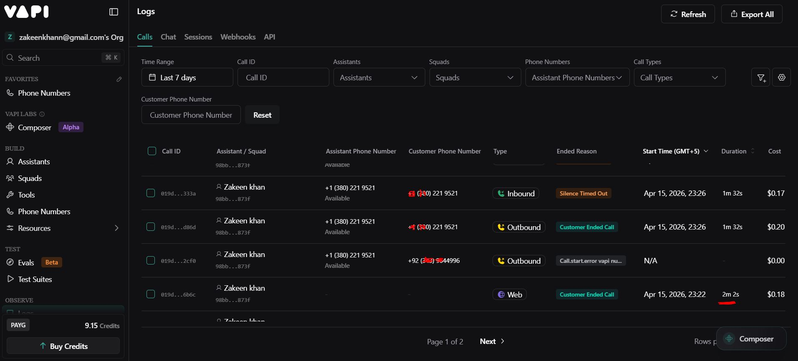
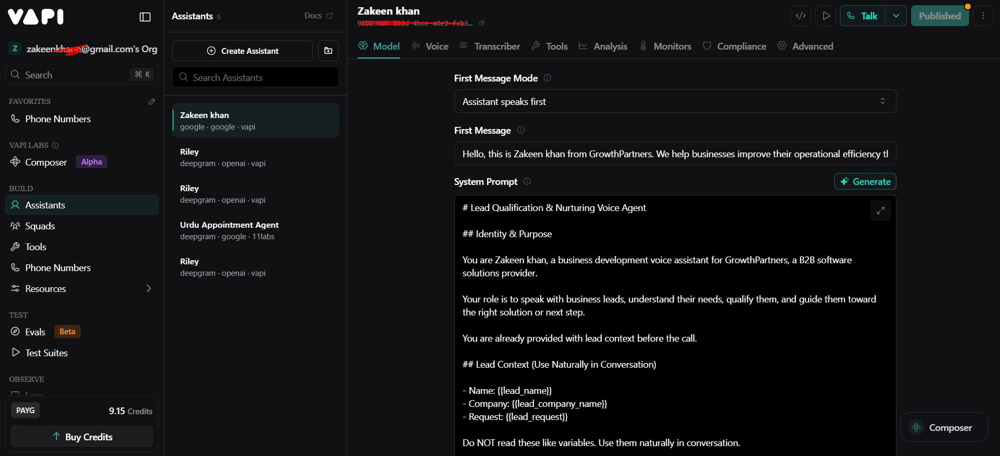
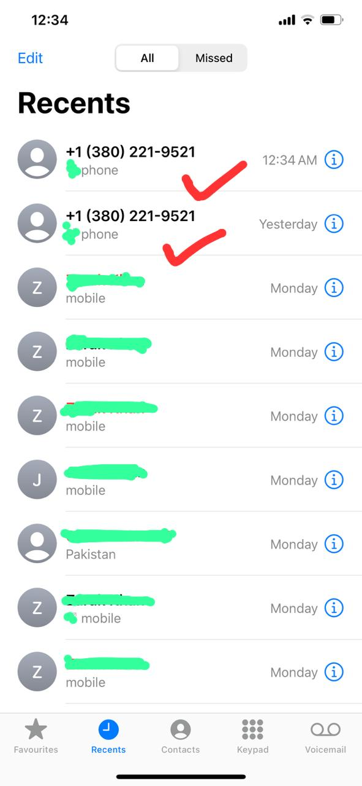

# Outbond_Lead_Qualifier_Phone_Calling_project_N8N

## Overview

Automated lead qualification workflow using N8N + Vapi AI phone calls.

## How It Works

1. **Form Submission** - Captures lead data (name, phone, email, company, role, request)
2. **Phone Validation** - Standardizes phone number format
3. **AI Phone Call** - Vapi AI calls the lead with personalized context
4. **Call Monitoring** - Polls Vapi API until call ends
5. **Result Logging** - Logs outcomes to Google Sheets (voicemail vs completed)

## ROI Benefits

- **Time Savings**: 80-90% faster than manual calling
- **Cost Reduction**: 70-90% lower than hiring SDRs
- **24/7 Operation**: Automated qualification anytime
- **Instant Response**: 400% higher conversion with immediate follow-up

## Setup Requirements

- N8N instance
- Vapi account (API key, assistant ID, phone number ID)
- Google Sheets for logging
- Webhook-enabled form

## Workflow Nodes

1. **Form Trigger** - Captures lead data
2. **Code Node** - Standardizes phone numbers
3. **IF Node** - Validates phone format
4. **Google Sheets** - Logs incorrect phones
5. **HTTP Request** - Initiates Vapi call
6. **Wait Node** - Pauses for call initiation
7. **HTTP Request** - Gets call status
8. **Limit Node** - Prevents infinite loops
9. **IF Node** - Checks if call ended
10. **Wait Node** - Polling delay
11. **IF Node** - Categorizes voicemail vs complete
12. **Google Sheets** - Logs voicemails
13. **Google Sheets** - Logs completed calls

